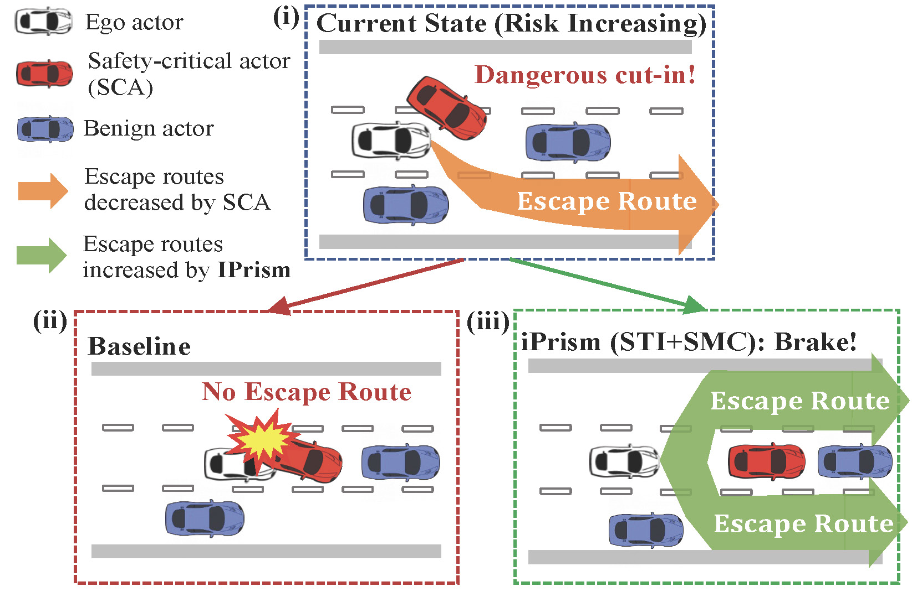
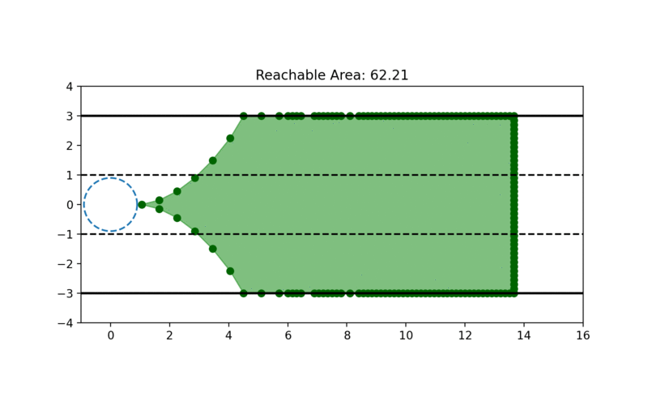

+++
author = "Ziheng (Jack) Chen"
title = "iPrism: Characterize and Mitigate Risk by Quantifying Change in Escape Routes"
description = "Accepted DSN 2024"
series = ["Projects"]
toc = false

+++

  <a href="https://github.com/zihengjackchen/iPrism">Paper (in proceeding)</a> |
  <a href="https://github.com/zihengjackchen/iPrism">GitHub (WIP)</a> |
  <a href="https://zenodo.org/doi/10.5281/zenodo.10279653">Artifact</a>

## Problem Statement
In complex and dynamic real-world situations involving multiple actors, ensuring safety is a significant challenge. This complexity often leads to severe accidents. We introduce a novel risk metric called the Safety-Threat Indicator (STI), which is inspired by the proactive strategies of experienced drivers to circumvent hazards by evaluating changes in available escape routes for the AV. STI outperforms the state-of-the-art heuristic and data-driven techniques by 2.7 ~ 4.9 times.

To effectively reduce the risks quantified by STI and prevent accidents, we also developed a reinforcement learning-based Safety-hazard Mitigation Controller (SMC). This controller learns optimal policies for risk reduction and accident avoidance. Our approach demonstrates a substantial reduction in the accident rate for advanced autonomous vehicle agents in rare hazardous scenarios—up to a 77% improvement over current state-of-the-art methods. 

All resources associated with this study, including code, scenarios, and models, are available on [GitHub](https://github.com/zihengjackchen/iPrism).

### Motivating Example

In a street scenario, an ego vehicle (AV) initially has multiple escape routes (highlighted in orange). However, when another vehicle abruptly cuts in front, these routes are blocked, increasing the risk of an accident. An illustration then shows the failure of the Autonomous Driving System (ADS) to respond, resulting in an accident and the loss of all escape routes. Finally, a depiction of the iPrism method, employing a reinforcement learning-based mitigation controller, demonstrates effective accident avoidance. By proactively braking, the ego vehicle opens new escape routes (in green), successfully circumventing the accident. This example highlights braking as the optimal action since changing lanes would eliminate the remaining escape routes.

## Quantifying Risk

### Calculating Reach Tube

This is a bird-eye-view of the traffic where three blue cars are present. The potential states of the ego vehicle (represented as a dashed circle), starting with 0 velocity at the original position, is calculated iteratively in time steps following the bicycle model using sampled controls (accleration and steering). The reach tube is the bounding polygon of all the possible states. 

### Calculating Risks

To calculate the risk of each actor, we first calculate the reach tube of the ego actor removing other actor one at a time, and finally removing all the other actors. 

The risk of an actor posed on the ego actor is calculated counterfactually by the increase in reach tube when removing that actor. The scene risk is calculated by finding the increase in reach tube when removing all other vehicles. Risks are always normalized. This example can be found in the [GitHub repo](https://github.com/zihengjackchen/iPrism/STI-demo) as well. 

### STI in Action

The above animation demonstrates the STI working in Argoverse, a real-world dataset. It shows the risk of other actors are inherently low.

  

The above animation shows STI working in ghost-cutin. The risk of the actor was detected prior to the cutting motion.

### Results
| **Metric**        | **Ghost Cut-In**   | **Lead Cut-In**    | **Lead Slowdown**      | **Rear-End**         | **All Scenarios** |
| ----------------- | ------------------ | ------------------ | ---------------------- | -------------------- | ----------------- |
| TTC               | 0.00 (0.00)        | 0.00 (0.00)        | 3.30 (0.89)            | 0.02 (0.17)          | 0.83              |
| Dist. CIPA        | 0.00 (0.00)        | 0.00 (0.00)        | **5.50 (0.89)**        | 0.02 (0.17)          | 1.38              |
| PKL-All           | 0.75 (0.30)        | 1.01 (0.76)        | 1.22 (0.62)            | 0.01 (0.12)          | 0.75              |
| PKL-Holdout       | 0.14 (0.21)        | 3.36 (4.18)        | 1.23 (0.69)            | 0.01 (0.12)          | 1.19              |
| **STI (ours)**    | **2.94 (0.33)**    | **8.37 (0.70)**    | 2.22 (0.23)            | **1.23 (0.11)**      | **3.69**          |

The above table demonstrates the comparative analysis of Lead-Time-for-Mitigating-Accident (LTFMA) in seconds across various risk metrics. The average time in seconds and the standard deviation are provided. PKL-All: trained on all scenarios. We used *LBC agent* as the ADS to control the ego actor to obtain these results.

**Notes:**
- PKL-Holdout: trained on all scenarios except the *ghost cut-in* and the *lead cut-in* scenarios.
- In the front accident scenario, the ego actor's ADS (*LBC agent*) avoided the accident, resulting in no LTFMA metric to report.
- *SD* stands for *standard deviation*.

## Mitigating Risk
### SMC in Action
We constantly assess the risk of the traffic and train an SMC using reinforcement learning. The SMC mitigates the imminent accident by braking based on the scene risk. 


In this example, without SMC intervention, an accident occurs when another actor aggressively cuts in. The SMC successfully mitigates the accident by braking when the risk is high. 

The above scenario is the ghost cut-in scenario #225 with parameters `{"distance_same_lane": 12, "distance_lane_change": 8, "speed_lane_change": 14}` and can be reproduced. 

### Results
| Agent                                             | Reasons for Comparison                                               | Ghost cut-in CA% | Lead cut-in CA% | Lead slowdown CA% |
|---------------------------------------------------|----------------------------------------------------------------------|------------------|-----------------|-------------------|
| **LBC+SMC w/ STI (LBC+system)**            | To show improvement over baseline agent.                             | 49%              | 98%             | 87%               |
| LBC+SMC w/o STI                            | To show that score is important (ablation study).                    | 1%               | 2%              | 86%               |
| LBC+TTC-based (ACA)                               | To show improvement w.r.t. ACA techniques.                           | 0%               | 0%              | 92%               |
| **RIP+SMC w/ STI (RIP+system)**            | To show generalization with other agents.                            | 86%              | 61%             | 71%               |

The above table shows the effectiveness of SMC in mitigating accidents comparing to other state-of-the-art methods. **CA%** stands for the percentage of accident scenarios (shown in TAS) prevented by the mitigation strategy. 

SMC significantly enhances safety, reducing accident occurrences by 37% to 98% compared to a baseline Learning-by-Cheating (LBC) agent. Additionally, SMC achieves up to 72.7% accident prevention when compared to state-of-the-art safety hazard mitigation agents.

## Authors 

  <a href="https://www.linkedin.com/in/shengkun-cui-332353136/">Shengkun Cui</a> |
  <a href="https://saurabhjha.one/">Saurabh Jha</a> |
  <a href="https://zihengjackchen.com">Ziheng Chen</a> |
  <a href="https://ece.illinois.edu/about/directory/faculty/kalbarcz">Zbigniew Kalbarczyk</a> | 
  <a href="https://ece.illinois.edu/about/directory/faculty/rkiyer">Ravishankar Iyer</a>

