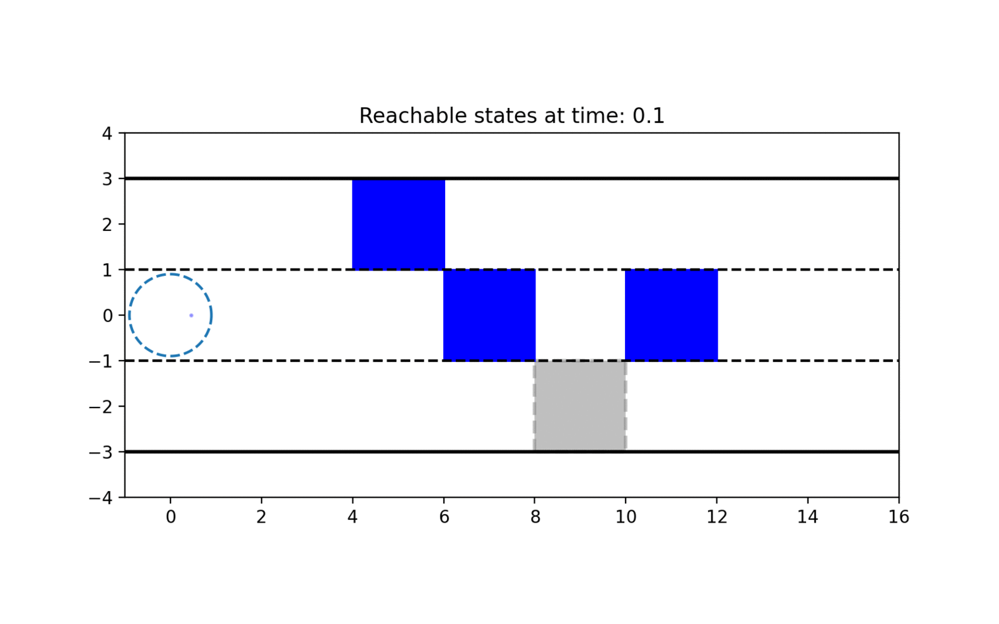
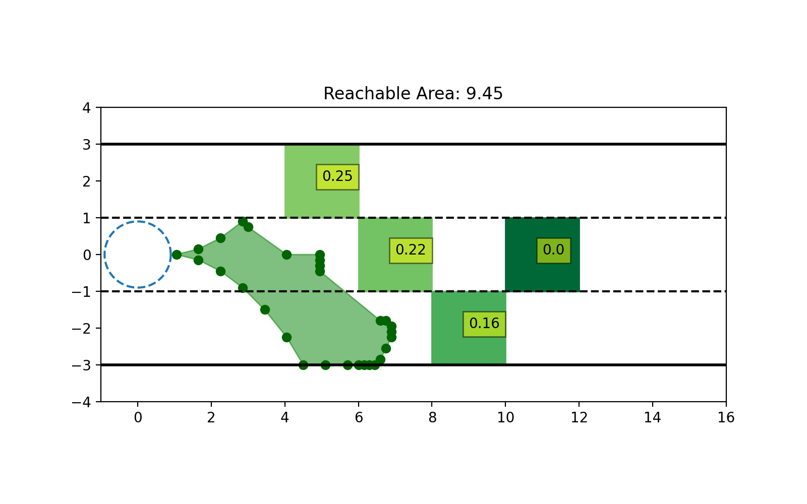

+++
author = "Ziheng (Jack) Chen"
title = "iPrism: Characterize and Mitigate Risk by Quantifying Change in Escape Routes"
description = "Accepted DSN 2024"
series = ["Projects"]
toc = false

+++

## Quantifying Risk

### Calculating Reach Tube
  
This is a bird-eye-view of the traffic where three blue cars are present. The potential states of the ego vehicle (represented as a dashed circle), starting with 0 velocity at the original position, is calculated iteratively in time steps following the bicycle model using sampled controls (accleration and steering). The reach tube is the bounding polygon of all the possible states. 

### Calculating Risks
  
To calculate the risk of each actor, we first calculate the reach tube of the ego actor removing other actor one at a time, and finally removing all the other actors. 

  
The risk of an actor posed on the ego actor is calculated counterfactually by the increase in reach tube when removing that actor. The scene risk is calculated by finding the increase in reach tube when removing all other vehicles. Risks are always normalized. This example can be found in the [GitHub repo](https://github.com/zihengjackchen/iPrism/STI-demo) as well. 

### STI in Action
  
The above animation demonstrates the STI working in Argoverse, a real-world dataset. It shows the risk of other actors are inherently low.

  

The above animation shows STI working in ghost-cutin. The risk of the actor was detected prior to the cutting motion.

### Results
| **Metric**        | **Ghost Cut-In**   | **Lead Cut-In**    | **Lead Slowdown**      | **Rear-End**         | **All Scenarios** |
| ----------------- | ------------------ | ------------------ | ---------------------- | -------------------- | ----------------- |
| TTC               | 0.00 (0.00)        | 0.00 (0.00)        | 3.30 (0.89)            | 0.02 (0.17)          | 0.83              |
| Dist. CIPA        | 0.00 (0.00)        | 0.00 (0.00)        | **5.50 (0.89)**        | 0.02 (0.17)          | 1.38              |
| PKL-All           | 0.75 (0.30)        | 1.01 (0.76)        | 1.22 (0.62)            | 0.01 (0.12)          | 0.75              |
| PKL-Holdout       | 0.14 (0.21)        | 3.36 (4.18)        | 1.23 (0.69)            | 0.01 (0.12)          | 1.19              |
| **STI (ours)**    | **2.94 (0.33)**    | **8.37 (0.70)**    | 2.22 (0.23)            | **1.23 (0.11)**      | **3.69**          |
- PKL-Holdout: trained on all scenarios except the *ghost cut-in* and the *lead cut-in* scenarios.
- In the front accident scenario, the ego actor's ADS (*LBC agent*) avoided the accident, resulting in no LTFMA metric to report.
- *SD* stands for *standard deviation*.

The above table demonstrates the comparative analysis of Lead-Time-for-Mitigating-Accident (LTFMA) in seconds across various risk metrics. The average time in seconds and the standard deviation are provided. PKL-All: trained on all scenarios. We used *LBC agent* as the ADS to control the ego actor to obtain these results.

